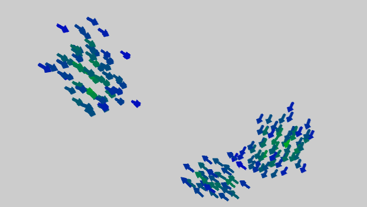

# OpenGL Boids

A demo of the classic boids simulation using OpenGL in C++. Adapted from a version written in Python over 6 years ago. 

I borrowed some of the GL code from [here](https://www.opengl-tutorial.org/), a great resource for getting into 3D graphics programming.

The `nBoids` value can be edited in `graphics.cpp` to change the number of arrows (default = 100). Orbiting around a central point, the boids will also change color based on the number of close-proximity neighbors.

The source files should be all set up for use with Visual Studio on Windows, but notionally you could get this to work on other systems using the required GL libraries (GLEW, glfw, glm etc.), shown in the command-line ootions below:

